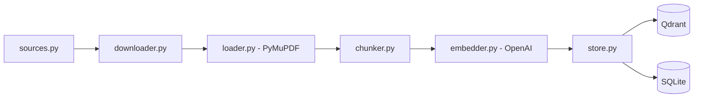
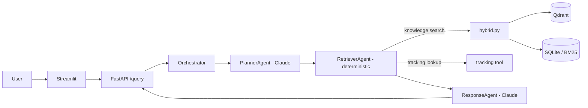

# LogiMind

Multi-agent RAG system for querying DHL's public operational documents in natural language — rate guides, customs guidelines, packing rules, prohibited items, incoterms, annual reports, sustainability report, and strategy documents.

Live demo: https://ui-production-b575.up.railway.app (rate-limited to 10 requests/minute)

## What it does

Ask something like "what items are prohibited from shipping with DHL?" or "where is my package with tracking number X?" and get a cited answer pulled from the actual source documents, or a simulated shipment status. Out-of-scope questions get refused rather than answered from general knowledge — the system only answers from what it actually retrieved.

## Architecture

### Ingestion (one-time batch)



- 14 PDFs, 874 pages, 5,133 chunks (512 chars, 64 overlap)
- Loader strips repeated per-page boilerplate (headers/footers) by detecting lines that repeat across most pages, rather than hardcoding patterns per document
- Every page was checked for extractable text before deciding whether OCR support was needed — all 874 had usable text, so OCR handling was left out instead of built speculatively
- Downloader retries with exponential backoff and skips already-downloaded files
- Embedding calls batched at 100 chunks/request; Qdrant writes batched separately at 200 points/request after hitting its 32MB per-request limit at full scale

### Query pipeline (runtime)



- Hybrid retrieval: Qdrant vector search and BM25 keyword search run independently, get deduplicated, then re-ranked with a cross-encoder (`ms-marco-MiniLM-L-6-v2`). The two methods surface genuinely different useful chunks on the same query, which is the actual point of running both instead of just one.
- PlannerAgent and ResponseAgent are Claude-backed AutoGen agents. RetrieverAgent deliberately isn't — it's plain deterministic Python, since Planner's decision already fully determines what needs to run. The orchestrator calls all three in a fixed sequence rather than using AutoGen's group-chat abstraction, since there's no open-ended agent-to-agent conversation to manage.
- Two tools available to the retrieval step: a knowledge search wrapping the hybrid retriever, and a simulated tracking lookup that deterministically derives a status from the tracking number so results stay consistent across repeat calls.
- LangSmith traces every step of the pipeline.
- `/query` is rate-limited (10/minute per client IP, proxy-aware) and caps question length, since every call spends real OpenAI/Anthropic budget.

### Monitoring and evaluation

- Every pipeline step (planner, retriever, responder) is timed and, for the two Claude-backed steps, billed by real token usage from AutoGen's `models_usage`, then written to SQLite. Retriever has no model cost since it's deterministic dispatch, not an LLM call — recorded as such rather than faked.
- Every live query also logs its question, answer, and retrieved context to SQLite at no extra API cost. A separate, deliberately-invoked eval loop samples unscored queries and judges them for faithfulness (does the answer's claims hold up against the retrieved context) and answer relevancy (does the answer actually address the question), via direct OpenAI calls — a judge model decomposing/verifying claims for the former, generated-question embedding similarity for the latter.
- This reimplements RAGAS's own metric definitions rather than depending on the `ragas` library: `ragas` only imports through an old LangChain chain that conflicts with the numpy version required elsewhere in the stack (sentence-transformers, scipy) and isn't reliably reproducible from a fresh install. Scoring logic ended up being about 30 lines against the OpenAI SDK directly, consistent with how the rest of this project avoids framework wrappers in favor of direct API calls.

### Deployment

Two separate Docker images rather than one: the API image carries the full ML stack (CPU-only torch build, not the default CUDA one); the UI image only needs `httpx` and `streamlit`, since it's just an HTTP client to the API. Deployed as two services on Railway.

## Stack

Python 3.12, Pydantic, PyMuPDF, OpenAI (embeddings, evaluation judge), Anthropic Claude + AutoGen (agents), Qdrant, BM25s, sentence-transformers, FastAPI, Streamlit, LangSmith, pytest.

## Running it locally

```
pip install -r requirements.txt
cp .env.example .env   # fill in API keys
python -m data.ingestion.store   # one-time: download, chunk, embed, store
uvicorn api.main:app --reload
streamlit run ui/app.py
```

The UI only needs `requirements-ui.txt`.

Or with Docker: `docker compose up --build`.

## Testing

`pytest` — 108 tests, all external calls mocked so the suite runs without hitting real APIs.

## Status

Ingestion, hybrid retrieval, the agent pipeline, monitoring (latency/cost tracking, faithfulness/relevancy evaluation), API/UI, Docker, CI, and deployment are all done. Still open: a curated ground-truth test set for retrieval-only quality scoring (context precision/recall).
