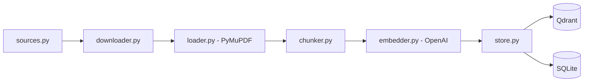
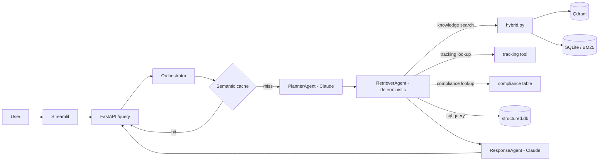

# LogiMind

Multi-agent RAG system for querying DHL's public operational documents in natural language — rate guides, customs guidelines, packing rules, prohibited items, incoterms, annual reports, sustainability report, and strategy documents. Beyond document search, it can look up shipment tracking, check structured compliance rules, and answer numeric questions against a structured revenue dataset — composing more than one of these in a single answer when a question needs it.

Live demo: https://logimind.muhammadawais.dev (rate-limited to 10 requests/minute)

## What it does

Ask something like "what items are prohibited from shipping with DHL?" and get a cited answer pulled from the actual source documents. Ask "where is my package with tracking number X, and what documentation do I need to ship it there?" and the system tracks the package first, then uses the real destination it found to check compliance rules for that country — two tool calls, one synthesized answer. Ask "what was DHL Group's Express division revenue in 2024?" and it writes and safely runs a read-only SQL query against a small structured dataset instead of searching documents. Out-of-scope questions get refused rather than answered from general knowledge — the system only answers from what it actually retrieved.

## Architecture

### Ingestion (one-time batch)



- 14 PDFs, 874 pages, 5,133 chunks (512 chars, 64 overlap)
- Loader strips repeated per-page boilerplate (headers/footers) by detecting lines that repeat across most pages, rather than hardcoding patterns per document
- Every page was checked for extractable text before deciding whether OCR support was needed — all 874 had usable text, so OCR handling was left out instead of built speculatively
- Downloader retries with exponential backoff and skips already-downloaded files
- Embedding calls batched at 100 chunks/request; Qdrant writes batched separately at 200 points/request after hitting its 32MB per-request limit at full scale

### Query pipeline (runtime)



- Hybrid retrieval: Qdrant vector search and BM25 keyword search run independently, get deduplicated, then re-ranked with a cross-encoder (`ms-marco-MiniLM-L-6-v2`). The two methods surface genuinely different useful chunks on the same query, which is the actual point of running both instead of just one.
- PlannerAgent and ResponseAgent are Claude-backed AutoGen agents. RetrieverAgent deliberately isn't — it's plain deterministic Python, since Planner's decision already fully determines what needs to run. The orchestrator calls all three in a fixed sequence rather than using AutoGen's group-chat abstraction, since there's no open-ended agent-to-agent conversation to manage.
- PlannerAgent produces an ordered list of steps, not a single action — compound questions decompose into multiple tool calls. A later step can reference an earlier step's actual result via a `{{step_N.field}}` placeholder (e.g. a compliance check using the destination a tracking lookup just returned), resolved by RetrieverAgent right before that step's tool runs.
- Four tools available to the retrieval step: a knowledge search wrapping the hybrid retriever; a simulated tracking lookup that deterministically derives a status from the tracking number so results stay consistent across repeat calls; a structured compliance-rule lookup (category + destination against a small curated table) for questions that need exact rule matching instead of passage search; and a natural-language-to-SQL tool that PlannerAgent writes the query for directly, executed read-only against a structured revenue dataset — validated as a single SELECT statement and run through a read-only SQLite connection as a hard backstop, since the query text is LLM-generated.
- A semantic cache sits in front of the whole pipeline: a repeated or near-duplicate question (matched by embedding similarity, not exact text) returns the previous answer directly, skipping Planner, Retriever, and Responder entirely.
- LangSmith traces every step of the pipeline.
- `/query` is rate-limited (10/minute per client IP, proxy-aware) and caps question length, since every call spends real OpenAI/Anthropic budget.

### Monitoring and evaluation

- Every pipeline step (planner, retriever, responder, and cache hits) is timed and, for the Claude-backed steps, billed by real token usage from AutoGen's `models_usage`, then written to SQLite. Retriever and cache hits have no model cost since neither makes an LLM call — recorded as such rather than faked, so the cost/latency delta a cache hit produces is directly visible in the same table.
- Every live query also logs its question, answer, and retrieved context to SQLite at no extra API cost. A separate, deliberately-invoked eval loop samples unscored queries and judges them for faithfulness (does the answer's claims hold up against the retrieved context) and answer relevancy (does the answer actually address the question), via direct OpenAI calls — a judge model decomposing/verifying claims for the former, generated-question embedding similarity for the latter.
- This reimplements RAGAS's own metric definitions rather than depending on the `ragas` library: `ragas` only imports through an old LangChain chain that conflicts with the numpy version required elsewhere in the stack (sentence-transformers, scipy) and isn't reliably reproducible from a fresh install. Scoring logic ended up being about 30 lines against the OpenAI SDK directly, consistent with how the rest of this project avoids framework wrappers in favor of direct API calls.
- **Adversarial evaluation**: a curated set of probes — prompt injection, system-prompt extraction, out-of-scope questions, and SQL-injection attempts against the SQL tool — run through the same judge-model pattern. The SQL-injection probes are scored deterministically (either the write got blocked or it didn't), not by a judge, since that's a fact rather than a judgment call.
- **Retrieval-only evaluation**: a ground-truth test set (question, reference answer, source page — hand-verified against the actual ingested PDFs, not fabricated) scores context precision (are relevant chunks ranked early, RAGAS's average-precision formulation) and context recall (does retrieved context actually cover the reference answer's claims) independent of generation quality. Kept deliberately separate from `monitoring/eval_loop.py` and self-contained within the retrieval layer — it doesn't import from the monitoring layer even though the judge-calling logic is identical, since retrieval code shouldn't depend on a layer above it.

### Deployment

Two separate Docker images rather than one: the API image carries the full ML stack (CPU-only torch build, not the default CUDA one); the UI image only needs `httpx` and `streamlit`, since it's just an HTTP client to the API. Deployed as two services on Railway.

## Performance

Measured on 13 real queries run through the full pipeline (same Claude/Qdrant/OpenAI backends the deployment uses) on 2026-08-02, spanning every document category, a tracking lookup, a combined tracking+knowledge query, and an out-of-scope refusal:

| Step | Avg latency | Avg cost |
|---|---|---|
| PlannerAgent (Claude) | 1.9s | $0.0024 |
| RetrieverAgent (deterministic) | 1.2s | — |
| ResponseAgent (Claude) | 6.3s | $0.0255 |
| **Total per query** | **~9.4s** | **~$0.028** |

Answer quality, scored by the eval loop described above:
- Faithfulness (answer claims checked against retrieved context): **0.98 average** across the 11 queries where the answer made checkable claims. The other 2 were correct refusals with no context to check against — one genuinely out-of-scope, one where retrieval found nothing relevant — so faithfulness is undefined for those rather than scored as low.
- Answer relevancy (generated-question similarity to the real question): **0.68 average** across all 13.

n=13 is enough to sanity-check the pipeline's real cost/latency/quality profile, not a statistically rigorous benchmark — it doesn't support claims about tail latency or worst-case behavior.

**Not yet re-measured**: this table predates the multi-step planner, the compliance/SQL tools, and the semantic cache. A single-tool question still follows the same path measured above, so these numbers should still roughly hold for that case, but nothing here reflects a real compound (multi-step) query's latency/cost, the new tools, or the cache's actual hit-rate savings in production. Re-running this benchmark against the current pipeline is still open — deliberately not done as a side effect of a README update, since it costs real API spend.

## Stack

Python 3.12, Pydantic, PyMuPDF, OpenAI (embeddings, evaluation judge, semantic cache), Anthropic Claude + AutoGen (agents), Qdrant, BM25s, sentence-transformers, SQLite (structured dataset, eval results), FastAPI, Streamlit, LangSmith, pytest.

## Running it locally

```
pip install -r requirements.txt
cp .env.example .env   # fill in API keys
python -m data.ingestion.store   # one-time: download, chunk, embed, store
uvicorn api.main:app --reload
streamlit run ui/app.py
```

The UI only needs `requirements-ui.txt`.

Or with Docker: `docker compose up --build`.

## Testing

`pytest` — 181 tests, all external calls mocked so the suite runs without hitting real APIs.

## Status

Ingestion, hybrid retrieval, the agent pipeline, monitoring (latency/cost tracking, faithfulness/relevancy evaluation), API/UI, Docker, CI, and deployment are all done.

Beyond the initial build:
- PlannerAgent decomposes compound questions into ordered, dependent steps instead of a single action.
- Two more tools beyond search and tracking: a structured compliance-rule lookup, and a natural-language-to-SQL tool (read-only, validated before execution) against a small structured revenue dataset pulled from DHL's actual 2024 Annual Report.
- Adversarial evaluation harness covering prompt injection, system-prompt extraction, out-of-scope questions, and SQL-injection attempts.
- Retrieval-only evaluation (context precision/recall) against a hand-verified ground-truth set — currently 7 seed cases, not yet the full curated set.
- A semantic cache in front of the pipeline, short-circuiting repeated or near-duplicate questions.

Still open: growing the ground-truth test set beyond its current seed size; re-benchmarking latency/cost/quality against the current (multi-step, multi-tool) pipeline, since the numbers above predate it; prompt versioning via a prompt hub; the real DHL tracking API in place of the simulated one; ingestion lineage tracking; and infrastructure-as-code for deployment.
